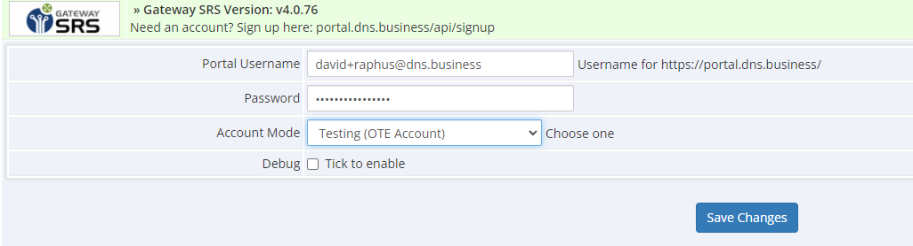
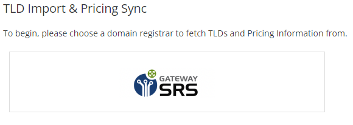

# WHMCS Module for Gateway SRS Domain Reseller Platform

## Overview

This document guides you through integrating the Gateway SRS Module with your WHMCS system. Ensure you follow the prerequisites and steps for a smooth installation and configuration process.

## Prerequisites

- Access to the WHMCS admin area.
- An active Gateway account with API access. Register at [https://portal.dns.business](https://portal.dns.business), accept the terms and conditions, and then request live or OT&E server credentials.

**Note**: DNS Gateway provides both a production environment and a test environment (OT&E). It is advisable to initially set up and test the WHMCS Registrar module in the OT&E environment before moving to the LIVE/PRODUCTION environment.

## Installation

### Step 1: Access Your WHMCS Directory
Navigate to your WHMCS directory:
```bash
cd /var/www/html/
```

### Step 2: Download the SRS Gateway Module
You can download the module using `wget` or `curl`:
```bash
sudo wget -O gateway_srs.zip https://github.com/DNS-Africa/Gateway-WHMCS/raw/master/gateway_srs.zip
```
Or:
```bash
sudo curl -Lo gateway_srs.zip https://github.com/DNS-Africa/Gateway-WHMCS/raw/master/gateway_srs.zip
```

### Step 3: Extract the Module
Extract the downloaded module:
```bash
sudo unzip -o gateway_srs.zip
```

## Configuration

To configure your WHMCS to use the Gateway SRS, follow these steps:

1. Log into your **WHMCS admin** panel.
2. Navigate to **Setup** menu > **Products/Services** > **Domain Registrars**.
3. Activate the Gateway SRS module by clicking **Activate** next to it.
4. Enter your DNS Portal account username and password. To test the module before going live simply enable "OTE Testing Mode".
   

### Optional Settings
If you encounter any issues, enable **Debug Mode** and check the logs at **Utilities > Logs > Module Log**. This setting ensures that only errors returned by the module are logged.

After configuring the settings, click **Save Changes**.

## Deployment

The Gateway SRS module is now ready and will operate like any other built-in WHMCS registrar module. To set Gateway SRS as the automatic registrar and configure TLDs and services for your customers, go to **Setup** menu > **Products/Services** > **Domain Pricing** in your WHMCS admin panel.

For additional information, refer to the [WHMCS Domain Configuration Guide](http://docs.whmcs.com/Domains_Configuration).

For support, please contact [support@dns.business](mailto:support@dns.business).

## Synchronise available domain extensions and pricing

1. Navigate to **Utilities** > **Registrar TLD Sync**.
2. Select **SRS Gateway**.
   
3. Enable **Automatic Registration** and set the mark up and rounding options required
4. Select desired domain extensions to import or go to the last tab and select all
   

### About Us

DNS Africa Ltd is an ICANN accredited (#2287) and ISO/IEC 27001:2013 certified domain name Registrar and recognised, Domain Registry Service Provider. In addition to providing various specialist domain name-related services and products in Africa and Internationally, we also provide, maintain, and support our domain name reseller platform: Gateway SRS. . Learn more about us at [www.dns.business](http://www.dns.business) as well as [www.gatewaysrs.com.business](http://www.gatewaysrs.com).
